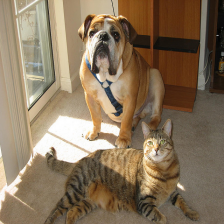
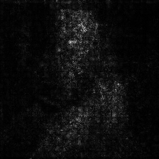
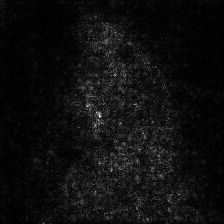
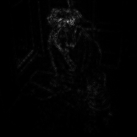
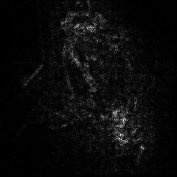

# SmoothGrad with PyTorch
WIP, not tested on GPU

## Dependencies

* Python 2.7
* PyTorch

## Examples

```bash
python main.py --image samples/cat_dog.png --no-cuda
```



CNN: ResNet-152<br>
Noise STD: 0.15<br>
#samples: 50

||bull mastiff|tabby|
|:-:|:-:|:-:|
|SmoothGrad|||
|Guided Backprop + SmoothGrad|||

## References
\[1\] D. Smikov, N. Thorat, B. Kim, F. Viégas, M. Wattenberg. "SmoothGrad: removing noise by adding noise". arXiv, 2017<br>
