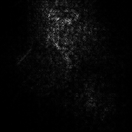
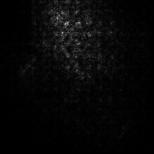
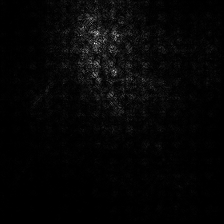

# SmoothGrad with PyTorch
WIP, not tested on GPU

## Dependencies

* Python 2.7
* PyTorch
* torchvision
* tqdm

## Examples

```bash
python main.py --image samples/cat_dog.png [--no-cuda] [--guided]
```


ResNet-152<br>
bull mastiff 54.2% @1<br>
#samples: 50

|Noise level (σ)|10%|15%|20%|
|:-|:-:|:-:|:-:|
|SmoothGrad [1]||||
|Guided Backprop + SmoothGrad||||
## References
\[1\] D. Smikov, N. Thorat, B. Kim, F. Viégas, M. Wattenberg. "SmoothGrad: removing noise by adding noise". arXiv, 2017<br>
