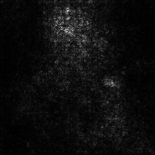

# SmoothGrad with PyTorch

PyTorch implementation of SmoothGrad [1].
WIP, not tested on GPU.

## Dependencies

* Python 2.7
* PyTorch
* torchvision
* tqdm

## Examples

```bash
python main.py --image samples/cat_dog.png [--no-cuda] [--guided]
```

With the ```--guided``` option, you can generate smoothed maps from guided backproped gradients.


Model: ResNet-152 pre-trained on ImageNet<br>
Prediction: *bull mastiff* - 54.3% @1<br>
#samples: 100

|Noise level (σ)|10%|15%|20%|
|:-|:-:|:-:|:-:|
|SmoothGrad [1]||||
|Guided Backprop + SmoothGrad||||
## References
\[1\] D. Smikov, N. Thorat, B. Kim, F. Viégas, M. Wattenberg. "SmoothGrad: removing noise by adding noise". arXiv, 2017<br>
